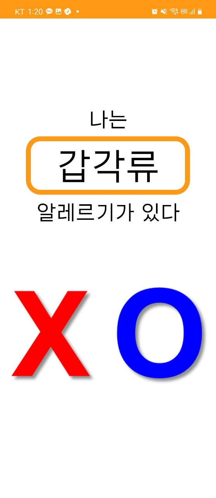

> ### 1. 앱 실행
| STEP 1 |
|:---:|
||
|누니앱을 실행하겠습니다.

----

> ### 2. 상품 인식 화면 소개 (상품 인식을 안 했을 경우)
| STEP 1 | STEP 2 |
|:---:|:---:|
|||
|   상품 인식 화면입니다. | 상품을 인식하기 전에 인식된 상품이 없다고 안내합니다.  | 

----

> ### 3. 알레르기 화면 소개
| STEP 1 |
|:---:|
||
|   알레르기 화면입니다. 아직 등록한 알레르기가 없습니다. 총 세가지 방법인 버튼, 탭 두드리기, 음성으로 대답하기를 통해 알레르기를 등록해보겠습니다. 화면을 두 번 터치하여 알레르기 등록 화면으로 이동합니다. (두 번 터치하기) |

----

> ### 4. 알레르기 등록 화면 소개
| STEP 1 | STEP 2 | STEP 3 | STEP 4 |
|:---:|:---:|:---:|:---:|
|||||
| (갑각류는 X 버튼을 누르기) | (달걀은 탭을 두 번 클릭하여 아니라고 대답하기) | (밀가루는 음성으로 '네'라고 대답하기) | 이렇게 등록을 완료하면 화면에서 등록된 알레르기를 확인할 수 있습니다.|

----

> ### 5. 상품 인식 화면 소개 (상품 인식하는 경우)
| STEP 1 | STEP 2 |
|:---:|:---:|
|||
|   상품 인식 화면입니다. | 상품을 인식하기 전에 인식된 상품이 없다고 안내합니다.  | 

----
